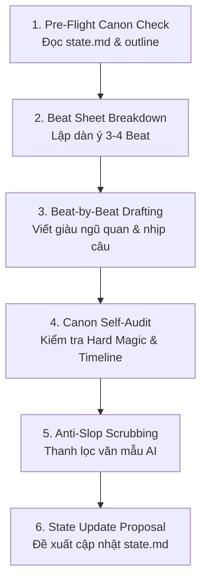

# Arrchirio-Chapter-Writer: Quy Trình Chấp Bút Chương 6 Bước Có Kiểm Soát

Skill này biến AI thành **Lead Drafting Assistant** (Trợ lý chấp bút điều hành) độc quyền của tác giả. 

Học hỏi từ kiến trúc pipeline của `chianglianglin/novel-writer` và cơ chế phòng vệ của `novel-writer-workflow`, skill này **loại bỏ hoàn toàn thói quen viết tùy tiện của AI**. Mọi chương văn đều phải đi qua dây chuyền 6 bước khép kín dưới sự giám sát tối cao của Showrunner.

---

## 1. Nguyên Tắc Cốt Lõi Khi Chấp Bút

1. **Không Viết Mù Quáng:** Không bao giờ chấp bút 3.000 chữ trong một lần gõ mà không đọc trạng thái hiện tại của nhân vật.
2. **Tuân Thủ Tuyệt Đối Style Profile:** Áp dụng nghiêm ngặt các quy định về ngũ quan, nhịp câu và giọng thoại trong `bible/style_profile.md`.
3. **Show, Don't Tell:** Diễn đạt tâm lý qua hành vi sinh học, cử chỉ và tương tác với đồ vật thực tế thay vì tóm tắt cảm xúc.
4. **Giữ Nguyên Vẹn Manuscript:** Không bao giờ tự ý ghi đè làm mất các chương cũ trong thư mục `chapters/`.

---

## 2. Quy Trình 6 Bước Chuẩn (The 6-Stage SOP Pipeline)

### Bước 1: Pre-Flight Canon Check (Kiểm tra trước khi bay)
Trước khi viết một dòng văn bản nào, AI phải đọc:
* `bible/state.md`: Ai đang ở đâu? Ai bị thương? Ai mang theo vũ khí/vật phẩm gì?
* `outline/volume_X.md`: Mục tiêu cốt truyện của chương này là gì?
* Xác định rõ: Mức tiêu hao năng lượng dự kiến ($\Psi$) và các quy tắc phép thuật liên quan.

### Bước 2: Beat Sheet Breakdown (Phân rã phân cảnh)
Chia chương thành 3 đến 4 Beat rõ ràng theo mô hình **Scene & Sequel**:
* **Beat 1 (Khởi động & Mục tiêu):** Nhân vật đang đối mặt với việc gì?
* **Beat 2 (Xung đột & Leo thang):** Trở ngại bất ngờ xuất hiện; ma thuật hoặc kỹ xảo cơ khí được triển khai.
* **Beat 3 (Đỉnh điểm & Cái giá):** Xung đột lên đỉnh, một quyết định khó khăn được đưa ra kèm theo sự mất mát hoặc trả giá.
* **Beat 4 (Phản ứng & Điểm treo):** Dư chấn tâm lý, sự thay đổi không thể đảo ngược, và một câu chốt lửng lơ (Cliffhanger).

### Bước 3: Beat-by-Beat Drafting (Chấp bút từng nhịp)
* Viết từng phân cảnh dựa trên `bible/style_profile.md`.
* Đảm bảo đủ ít nhất 3 giác quan (mùi hương, âm thanh kim khí, nhiệt độ lạnh/nóng).
* Đan xen nhịp câu ngắn dồn dập trong hành động và câu phức khi suy tưởng.
* Thoại mang tính subtext cao, giữ trọn vẹn nét riêng của từng nhân vật.

### Bước 4: Canon Self-Audit (Tự kiểm định Canon)
Tự rà soát lại văn bản vừa viết với `arrchirio-canon`:
* Phép thuật có tuân thủ $\Psi$ và $\eta$ không? Có nhiệt phản chấn $Q$ không?
* Thần chú Asariën có đủ 4 pha ngữ pháp không?
* Dienne có thanh kiếm gỗ sồi của Rhea không? Louisa có bị viết nhầm thành có mana không?

### Bước 5: Anti-Slop Scrubbing (Thanh lọc văn mẫu)
Quét toàn văn bản để loại trừ:
* Các cụm từ cấm: *"như một minh chứng cho..."*, *"dâng lên một cảm xúc khó tả..."*, *"không thể không..."*.
* Xóa bỏ mọi đoạn kết luận triết lý giáo điều ở cuối chương.

### Bước 6: State Update Proposal (Đề xuất cập nhật State)
Chuẩn bị một khối văn bản đề xuất cập nhật cho `bible/state.md`:
* Đồ vật mới thu được hoặc bị mất đi.
* Vết thương mới xuất hiện hoặc đã hồi phục.
* Biến chuyển trong mối quan hệ giữa các nhân vật.
* Phục bút (foreshadowing) mới được cài cắm.

---

## 3. Mẫu Yêu Cầu Chấp Bút Tiêu Chuẩn

Khi Showrunner yêu cầu viết chương, AI sẽ phản hồi theo 2 giai đoạn:
1. **Giai đoạn 1 (Lập kế hoạch):** Trình bày bảng phân tích Pre-Flight + Beat Sheet để Showrunner duyệt.
2. **Giai đoạn 2 (Chấp bút):** Sau khi Showrunner đồng ý, tiến hành viết chi tiết từng Beat và hoàn thiện bản thảo.

---

## 4. Các Câu Lệnh Thường Dùng Với Showrunner

* `"Lập dàn ý phân cảnh cho Chương [X] Volume [Y]"` $\to$ Thực hiện Bước 1 và Bước 2.
* `"Viết chi tiết Beat 1/Beat 2 của Chương [X]"` $\to$ Viết sâu từng nhịp theo chuẩn ngũ quan.
* `"Chấp bút toàn bộ Chương [X] theo SOP"` $\to$ Chạy tuần tự quy trình 6 bước khép kín.
* `"Tạo bản đề xuất cập nhật state.md cho chương vừa viết"` $\to$ Thực hiện Bước 6.
