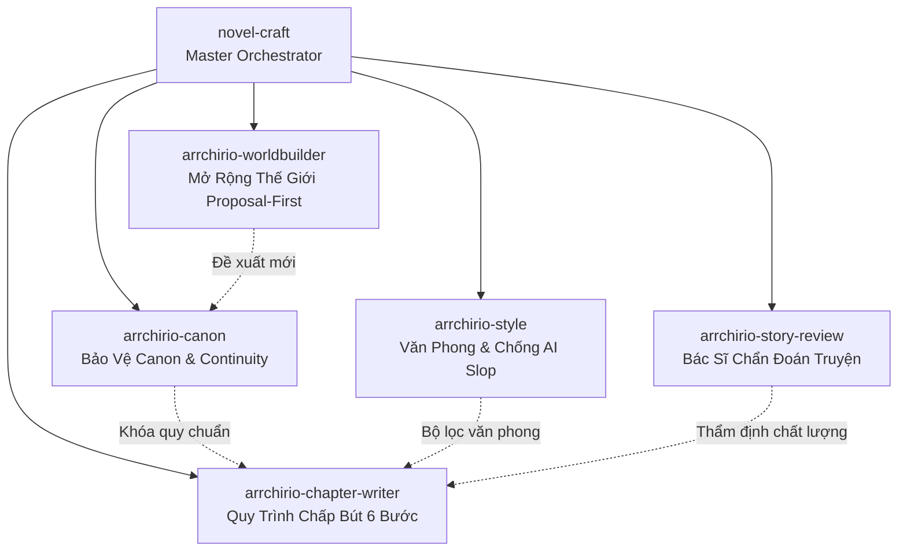

# Novel-Craft: Tổng Điều Phối Sáng Tác Arrchirio (Master Orchestrator)

Skill này đóng vai trò là **Nhạc trưởng điều phối (Master Orchestrator)** toàn bộ hệ thống hỗ trợ sáng tác cho tác phẩm *Arrchirio: The Seventh Gate*. 

Khi Showrunner đưa ra yêu cầu sáng tác chung hoặc cần định tuyến công việc, `novel-craft` sẽ xác định chính xác năng lực nào cần được kích hoạt từ bộ **5 Skill Chuyên Biệt**:

---

## 1. Bản Đồ Điều Phối 5 Skill Chuyên Biệt

| Khi Showrunner yêu cầu... | Trọng tâm công việc | Skill chuyên trách chịu trách nhiệm |
|:---|:---|:---|
| **Kiểm tra mâu thuẫn, timeline, Hard Magic $\Psi$, Asariën** | Rà soát `bible/state.md`, `bible/canon_audit.md`, khóa mốc sự kiện. | 🛡️ `arrchirio-canon` |
| **Gọt giũa câu chữ, khử văn mẫu AI, chỉnh nhịp câu, sửa giọng thoại** | Áp dụng `bible/style_profile.md`, tăng tương tác ngũ quan. | 🎨 `arrchirio-style` |
| **Bắt bệnh phân cảnh, tìm nguyên nhân chương bị trôi tuột, chỉnh pacing** | Chẩn đoán theo mô hình Story Sense: Scene Engine, Desire, Dilemma, Cost. | 🩺 `arrchirio-story-review` |
| **Lên dàn ý phân cảnh, chấp bút chương mới theo quy trình khép kín** | Pipeline 6 bước: Pre-Flight $\to$ Beat Sheet $\to$ Show-Don't-Tell $\to$ Audit. | ✍️ `arrchirio-chapter-writer` |
| **Nghĩ thêm thành phố, dị tộc, ma đạo cụ, tổ chức ngầm mới** | Phỏng vấn chuyên sâu từng lớp (Writers Toolkit), xuất bản `[PROPOSAL]`. | 🏛️ `arrchirio-worldbuilder` |

---

## 2. Triết Lý Làm Việc Bất Di Bất Dịch

1. **Showrunner là Tối Cao:** AI là Trợ lý / Bác sĩ / Người gác cổng. AI không tự ý quyết định số phận nhân vật hay sửa đổi canon khi chưa có lệnh.
2. **Không Viết AI Slop:** Tuyệt đối cấm văn mẫu khuôn sáo, sáo rỗng. Mọi cảnh quay đều phải có sức nặng vật lý và rung cảm sinh học.
3. **Hard Magic Compliance:** Không có phép thuật giải quyết mọi vấn đề mà không có hao phí $\eta$ hay áp lực nhiệt lượng $Q$.
4. **Bảo Vệ Bản Thảo:** Luôn lưu trữ và bảo vệ các bản thảo trong `chapters/`, cập nhật liên tục biến động nhân vật vào `bible/state.md`.
