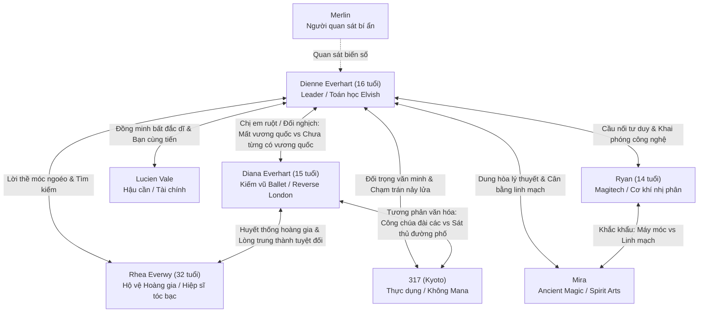

# Story Bible: Hồ Sơ Nhân Vật (Characters)

> **Tệp này ghi nhận tính cách, giọng điệu, mục tiêu, trang bị và cấm kỵ của từng nhân vật trong tác phẩm.**
> Mọi chương viết ra phải tuân thủ nghiêm ngặt hồ sơ này để đảm bảo không bị biến dạng tính cách (**OOC - Out of Character**).

---

# 1. NHÂN VẬT CHÍNH: Dienne Everhart

### Thông Tin Cơ Bản
- **Họ và tên**: Dienne Everhart (Bí danh tại Học viện: *Dienne Hart*).
- **Xuất thân**: Công chúa của Vương quốc Tự trị Everhart (đã bị Đế quốc Aurelia xóa sổ trong đêm thanh trừng).
- **Độ tuổi qua các Volume**:
  - *Volume 1*: 6 tuổi (đêm Everhart sụp đổ) $\to$ 12 tuổi (ngọn lửa lam đầu tiên) $\to$ 15 tuổi (rời thung lũng tuyết).
  - *Volume 2 - 3*: 15 $\to$ 16 tuổi (tại Aetheris và thâm nhập Kyoto).
  - *Volume 4*: 16 tuổi (thành lập Arrchirio mới tại pháo đài ngầm Sector 7).
- **Ngoại hình**: Dáng người thon gọn, dẻo dai. Mái tóc dài màu hạt dẻ buộc gọn gàng sau gáy. Đôi mắt màu lam thẫm sâu thẳm như hồ băng, ánh mắt tĩnh lặng, kiên nghị vượt xa tuổi tác.
- **Trang phục & Hành trang**:
  - Áo choàng đen sờn gấu có mũ trùm.
  - Chiếc trâm cài vương tộc Everhart giấu kín dưới đáy túi da.
  - Huy hiệu nhánh cây bạc của Arrchirio cài sát bên ngực trong.
  - Cuốn sổ tay ghi chép ngữ pháp Elvish và sơ đồ năng lượng hai thế giới.
  - **Vũ khí bất ly thân**: Thanh kiếm gỗ cũ kỹ sứt sẹo của Rhea, giắt chặt bên hông trái.

### Động Cơ & Tâm Lý (The Core Arc)
- **Khao khát bề nổi (Want)**: Tìm thấy Rhea Everwy và lật tẩy kẻ phản bội đã hủy diệt quê hương Everhart.
- **Nhu cầu nội tâm (Need)**: Vượt qua lòng căm thù cá nhân; nhận ra thế giới không đơn giản chỉ là "thiện vs ác"; học cách trở thành người bảo vệ Cân Bằng thực sự thay vì biến Arrchirio thành công cụ báo thù.
- **Vết thương quá khứ (The Ghost/Wound)**: Đêm lâu đài Everhart bốc cháy năm 6 tuổi, phải trốn dưới gầm bàn và nhìn bóng lưng Rhea ở lại bọc hậu giữa biển lửa.
- **Điểm yếu (Flaw)**: Quá dựa vào phân tích lý thuyết toán học/công thức; ban đầu thiếu kinh nghiệm thực chiến đường phố; đôi khi quá gánh vác trách nhiệm một mình.

### Phong Cách Ma Thuật & Chiến Đấu
- **Thế mạnh**: Tư duy toán học kết hợp ngữ pháp Elvish nguyên bản. Tốc độ phân tích cấu trúc ma trận cực nhanh, triển khai phép không có động tác thừa.
- **Vũ khí**: Kết hợp truyền mana gia cố độ cứng/bén vào thanh kiếm gỗ + phóng thích ma thuật nguyên tố (gió nén, lửa lam tinh khiết, ma trận phong tỏa).

### Giọng Thoại & Hành Vi
- **Xưng hô**: "Tôi - Cậu" (với Lucien, Ryan, Mira, 317); "Cháu - Thầy/Ngài" (với người thầy già và người lớn tuổi); "Em - Chị" (với Rhea).
- **Hành vi vô thức khi căng thẳng**: Ngón tay chạm vào chuôi kiếm gỗ của Rhea; ánh mắt khóa chặt đối phương và tính toán trong đầu.
- **CẤM KỴ OOC**:
  - Tuyệt đối KHÔNG hành xử như kẻ phản diện mù quáng vì thù hận (không biến Arrchirio thành nhóm khủng bố như Vane muốn).
  - Không bao giờ tự phụ mình là thiên tài toàn tri.
  - Không bao giờ phá vỡ lời thề móc ngoéo với Rhea.

---

# 2. NGƯỜI BẢO VỆ: Rhea Everwy

### Thông Tin Cơ Bản
- **Họ và tên**: Rhea Everwy.
- **Vai trò**: Đội trưởng Đội Hộ vệ Hoàng gia Everhart; người bảo vệ và là chỗ dựa tinh thần lớn nhất thời thơ ấu của Dienne.
- **Độ tuổi**: Khoảng 22 tuổi (khi Everhart sụp đổ) $\to$ Khoảng 32 tuổi (ở thời điểm hiện tại Volume 4).
- **Ngoại hình**: Dáng người cao ráo, vững chãi. Mái tóc màu bạc cắt ngắn ngang vai. Đôi mắt xám tro lạnh lùng nhưng ấm áp. Giáp nhẹ hoen rỉ mang nhiều vết chém, áo choàng rách mang huy hiệu Everwy phai màu. Bàn tay chằng chịt sẹo kiếm.
- **Trang bị**: Trường kiếm bạc phát ra luồng kiếm khí sắc lẹm, bão mana màu bạc.

### Tính Cách & Động Cơ
- **Lý tưởng**: Danh dự của một hiệp sĩ chân chính ("Ta sẽ không để các ngươi chạm vào người").
- **Vết thương nội tâm**: Nỗi đau dằn vặt vì không thể bảo vệ vương quốc và phụ hoàng của Dienne; phải nói lời nói dối duy nhất trong đời rằng "chúng ta sẽ quay lại".
- **Hành tung hiện tại**: Sống sót sau trận chiến ở Cổng Cổ Đại, ẩn danh hoạt động ở các vùng biên cương hẻo lánh ngoài tầm với của Đế quốc.

### Giọng Thoại & Hành Vi
- Điềm đạm, vững vàng như một bức trường thành. Thích trêu chọc những chỗ trốn ngây ngô của Dienne bé bỏng.
- **CẤM KỴ OOC**: Tuyệt đối không đầu hàng Đế quốc; không từ bỏ lời hứa tìm lại Dienne; không hành động hèn hạ sau lưng người khác.

---

# 3. CON NGƯỜI KHÔNG MANA: 317

### Thông Tin Cơ Bản
- **Tên thường gọi**: **317** (Bắt nguồn từ ngày sinh: 17 tháng 3 $\to$ 3/17 $\to$ 317).
- **Tên giả ngẫu hứng**: Louisa Swordman (tự nghĩ ra cho ngầu khi trêu tội phạm).
- **Tên thật**: Chưa từng tiết lộ (cô từ chối dùng tên do người khác đặt).
- **Độ tuổi**: Khoảng 17 - 19 tuổi.
- **Thế giới gốc**: **Thế giới thực (Kyoto, Trái Đất)**.
- **Ngoại hình**: Cô gái châu Á mảnh khảnh. Mái tóc đen buộc túm cẩu thả sau gáy. Trang phục đặc trưng: Áo khoác bomber đen rộng thùng thình, áo phông trắng, quần túi hộp thụng, giày bốt đen. Miệng thường xuyên ngậm kẹo mút vị dâu hoặc nhai kẹo cao su thổi bóng.
- **Trang bị & Đạo cụ**:
  - Súng lục giảm thanh giắt trong bao da dưới nách (dùng đạn hợp kim nặng trịch phi ma thuật).
  - Dao găm ngắn / tantō dắt ngang thắt lưng sau.
  - Còi bạc cộng hưởng âm tần phá sóng ma trận.
  - Súng phóng dây móc leo trèo.
  - Túi bùa chú yểm sẵn và ma thạch thô (dùng bằng mẹo kích hoạt cơ học chứ không tự dẫn mana).
  - Thẻ kim loại đen bóng khắc số `317`.

### Bản Chất Năng Lực (Canon Bất Khả Xâm Phạm)
- **100% Con người bình thường về mặt sinh học**.
- **HOÀN TOÀN KHÔNG CÓ MANA NỘI TẠI**. Không thể tự sinh mana, không có mạch mana.
- **Không phải sản phẩm thí nghiệm, không phải dị nhân, không thuộc tổ chức sát thủ bí mật**.
- Sức mạnh đến từ: Phản xạ thể chất đỉnh cao, chiến thuật đường phố, nắm bắt điểm yếu kết cấu ma pháp trận để bắn phá, cận chiến thực dụng đến tàn nhẫn.

### Tính Cách & Giọng Thoại
- Cợt nhả, thích cà khịa, nhây, ăn nói bất cần đời nhưng cực kỳ tỉnh táo trong thực chiến.
- Rất coi trọng sự tự do cá nhân, ghét những kẻ đạo đức giả hoặc quý tộc phù thủy kiêu ngạo.
- **CẤM KỴ OOC**:
  - Tuyệt đối KHÔNG bao giờ tự tạo ra phép thuật bằng cơ thể mình.
  - Không bao giờ gia nhập Arrchirio hay bất kỳ tổ chức nào với tư cách cấp dưới nhận lệnh.
  - Không biến thành nhân vật sát thủ u ám "ngầu lòi vô cảm".

---

# 4. HẬU CẦN & CHẾ TÁC: Lucien Vale

### Thông Tin Cơ Bản
- **Họ và tên**: Lucien Vale.
- **Vai trò trong Arrchirio mới**: Phụ trách mạng lưới thông tin, tài chính, hậu cần và mua sắm ma cụ.
- **Độ tuổi**: 16 - 17 tuổi.
- **Xuất thân**: Học viên chuyên ngành Chế tác Ma cụ tại Học viện Aetheris.
- **Ngoại hình**: Mái tóc nâu rối bù, ngón tay luôn dính muội than ma thạch, áo khoác nhiều túi nhét đầy bản đồ và phát minh dở dang. Chiếc la bàn ma lực định hướng dòng chảy năng lượng luôn đeo trên cổ.

### Tính Cách & Giọng Thoại
- Thực dụng, láu cá, hay cằn nhằn về tiền bạc và ngân sách ("Tôi là thằng thích tiền, không phải thằng thích chết").
- Tuy luôn miệng kêu ca nhưng khi bạn bè gặp hiểm nguy thì không bao giờ bỏ chạy một mình ("Tôi đâu có nói tôi là thằng thông minh!").
- Điểm tựa đời thường giúp Dienne không bị cô lập trong mớ suy nghĩ triết học nặng nề.

---

# 5. KỸ SƯ MAGITECH: Ryan

### Thông Tin Cơ Bản
- **Họ và tên**: Ryan.
- **Vai trò trong Arrchirio mới**: Trưởng ban Kỹ thuật, nghiên cứu Magitech và chế tạo trang thiết bị.
- **Độ tuổi**: 14 tuổi.
- **Xuất thân**: Thợ cơ khí ma đạo tự do tại khu xưởng ngầm Oakhaven.
- **Ngoại hình**: Thiếu niên gầy gò, mái tóc hạt dẻ xù luôn bết dính dầu máy, chiếc kính bảo hộ ma thuật gác lệch trên trán, tay cầm cờ-lê hoặc máy đo ma áp.

### Tính Cách & Tư Duy
- Bộc trực, ghét lý thuyết suông và những nghi thức trang nghiêm sến sẩm ("Tôi chỉ cần tiền mua linh kiện thôi!").
- Cực kỳ say mê cách vận hành của máy móc và công nghệ phi ma thuật từ Kyoto (mạch nhị phân, cuộn cảm ứng điện từ).
- Chế tạo thành công thiết bị xung điện từ (EMP ma đạo) đánh bại Thẩm Phán Viện.
- **CẤM KỴ OOC**: Không được viết Ryan thành "thiên tài toàn năng búng tay là ra máy"; cậu phải luôn thử nghiệm, đo đạc, sai sót và sửa chữa.

---

# 6. HỌC GIẢ LINH MẠCH: Mira

### Thông Tin Cơ Bản
- **Họ và tên**: Mira.
- **Vai trò trong Arrchirio mới**: Phụ trách phong ấn, nghi thức cổ xưa, Ancient Magic và Spirit Arts.
- **Độ tuổi**: 17 - 18 tuổi.
- **Xuất thân**: Ẩn sĩ tại vùng phế tích rừng thiêng biên giới.
- **Ngoại hình**: Mái tóc đen dài buông xõa, trang phục truyền thống thêu chỉ bạc trang nghiêm, ánh mắt sắc sảo lạnh lùng như sương sớm.

### Tính Cách & Tư Duy
- Tôn kính tự nhiên và nhịp thở của linh mạch; coi ma thuật là một sinh mệnh sống chứ không phải công cụ cơ khí khô khốc.
- Thường xuyên khắc khẩu với Ryan (chê dầu máy bẩn thỉu, chê máy móc phá hủy linh mạch).
- Bị thuyết phục bởi sự khiêm tốn và dám nhìn thẳng vào sự thật của Dienne trong cuộc đối đầu với Vane.

---

# 7. NGƯỜI QUAN SÁT CỔ ĐẠI: Merlin

### Thông Tin Cơ Bản
- **Tên**: Merlin (Tên thật, tuổi thật, chủng tộc: **CHƯA ĐƯỢC TIẾT LỘ**).
- **Vị trí**: Người quan sát bí ẩn đứng ở ranh giới giữa các thế giới, đang theo dõi sự dao động của Cổng thứ bảy.
- **Đặc trưng**:
  - Am hiểu sâu sắc về mana, Elvish, Cổng và lịch sử cổ đại.
  - **TUYỆT ĐỐI KHÔNG TOÀN TRI**: Kiến thức của Merlin có giới hạn. Cô có thể đưa ra giả thuyết sai hoặc bị bất ngờ trước những thứ vượt ngoài mô hình của mình (như Cánh Cửa Thứ Hai).
  - Không can thiệp trực tiếp để giải quyết vấn đề hộ nhân vật chính.
- **Câu nói triết lý nền tảng**:
  > *"Không có phép nào mạnh, phép nào yếu — chỉ có nhiều mana và ít mana."*
  > *"Phép thuật chính là thứ phóng đại bản chất con người."*

---

# 8. CÔNG CHÚA CHƯA TỪNG CÓ VƯƠNG QUỐC: Diana Everhart
### (Diana of Reverse London)

### Thông Tin Cơ Bản
- **Họ và tên**: Diana Everhart (Tên thường gọi tại Reverse London: *Diana Sterling*).
- **Xuất thân**: Công chúa thứ hai của Vương tộc Everhart, em gái ruột của Dienne Everhart. Sinh ra tại **Reverse London** (London Nghịch Đảo) sau khi cha mẹ trốn thoát khỏi đêm thanh trừng của Đế quốc Aurelia.
- **Độ tuổi**: Khoảng 14 – 15 tuổi (kém Dienne khoảng 1 – 2 tuổi).
- **Ngoại hình**: Vẻ đẹp thanh tao, đài các toát lên từ trong máu tủy. Mái tóc vàng óng gợn sóng buông nhẹ sau lưng, đôi mắt màu lam trong veo như pha lê (màu mắt đặc trưng của dòng máu hoàng gia Everhart).
- **Trang phục**: Thường mặc váy dạ hội cách tân hoặc âu phục quý tộc Anh may bằng lụa sẫm màu, tà váy xếp ly mềm mại được thiết kế đặc biệt để mở rộng tối đa theo từng bước xoay người khi múa kiếm.
- **Vũ khí**: Một thanh liễu kiếm (rapier) bằng bạc tinh luyện mỏng nhẹ và dẻo dai, chuôi kiếm nạm đá sapphire khắc gia huy rồng vàng Everhart.

---

### Nghịch Lý Cốt Lõi: Hai Nàng Công Chúa Của Everhart
Tác phẩm xây dựng một cặp đối trọng mang tính triết học và cảm xúc sâu sắc giữa hai chị em:

> **"Dienne là công chúa đã mất vương quốc."**  
> *(The Princess Who Lost Her Kingdom)*  
> **"Diana là công chúa chưa từng có vương quốc."**  
> *(The Princess Who Never Had A Kingdom)*

- **Dienne**: Bị tước đoạt vương quốc lúc 6 tuổi, lớn lên trong thung lũng tuyết giá lạnh, ăn bánh mì khô, mặc áo choàng sờn gấu, dùng kiếm gỗ sứt sẹo, tư duy bằng toán học và sự tàn khốc của sinh tồn. Dienne lớn lên gần như quên mất thế nào là cuộc sống hoàng gia. Với Dienne, *Everhart là một vết thương rỉ máu*.
- **Diana**: Sinh ra trong một ngôi nhà bình dân ở Reverse London, nơi cha mẹ cô phải giấu thân phận, dùng tên giả và làm lụng như thường dân để mưu sinh. Nhưng trong căn nhà bình thường ấy, cha mẹ đã dồn hết tâm huyết âm thầm truyền dạy cho cô mọi chuẩn mực của hoàng tộc: lễ nghi, văn hóa, lịch sử, khiêu vũ, âm nhạc, kiếm thuật và ma thuật. Với Diana, *Everhart là một nền văn hóa, một bản trường ca đẹp đẽ chưa từng được nhìn thấy bằng mắt thường*.

### Khoảnh Khắc Hội Ngộ Giữa Hai Chị Em
- Khi Dienne nhìn Diana: *"Em ấy trông giống một công chúa thực thụ hơn mình..."*
- Khi Diana nhìn Dienne: *"Chị mới là người thực sự sống cuộc đời mà em chỉ được nghe kể qua lời ru của cha mẹ..."*

---

### Khí Chất & Phong Thái Tự Nhiên
- Diana không bao giờ phải cố tỏ ra sang chảnh. Khí chất vương giả đã ăn sâu vào phản xạ vô thức:
  - Người khác bước vào phòng: Kéo ghế ngồi bệt xuống.
  - Diana bước vào phòng: Vô thức chỉnh lại nếp váy, giữ lưng thẳng tắp thanh nhã, mỉm cười và cúi chào mọi người chuẩn xác theo lễ nghi hoàng gia cổ xưa.
- **Tài năng đặc biệt — Giọng hát mê hoặc**: Diana sở hữu giọng hát trong trẻo và truyền cảm tuyệt mỹ. Những bài dạ khúc và cổ ca Everhart cô hát có khả năng tạo ra sự cộng hưởng âm học đặc biệt, xoa dịu những mạch mana đang co giật hoặc đánh thức những ký ức bị phong ấn.

---

### Phong Cách Chiến Đấu: Kiếm Vũ Ballet & Ma Thuật Trong Chuyển Động

#### 1. Kiếm Thuật Ballet (Ballet-Swordsmanship):
Kiếm pháp của Diana hoàn toàn không dựa vào cơ bắp hay những cú chém nặng nề. Nó là sự tinh hoa của: **Bước chân (Footwork) $\to$ Thăng bằng (Balance) $\to$ Xoay mũi chân (Pirouette) $\to$ Trọng tâm $\to$ Nhịp điệu $\to$ Độ chính xác tuyệt đối**.
- Nhìn từ bên ngoài, đối thủ ngỡ như cô đang biểu diễn một khúc múa ba-lê cổ điển trên sân khấu. Nhưng thực chất, mỗi bước trượt, mỗi cú xoay người đều là một quỹ đạo chết người:
  > *Diana xoay tròn trên mũi chân. Mũi liễu kiếm lướt qua khoảng không như một nét cọ bạc mảnh mai. Một bước. Hai bước. Tà váy xếp ly bung xòe theo chuyển động cơ thể. Đối thủ vừa kịp nhận ra mình đã bị áp sát thì lưỡi kiếm lạnh toát đã dừng chuẩn xác ngay trước yết hầu.*

#### 2. Ma Thuật Dệt Trong Vũ Điệu (Magic in Motion):
Khác với Dienne: `[Phân tích] -> [Tính toán] -> [Dựng ma trận] -> [Thi triển]`.  
Diana vận hành theo: `[Cảm nhận] -> [Nhịp điệu] -> [Vũ đạo] -> [Thi triển]`.
- Diana không bao giờ đứng yên một chỗ để niệm chú hay vẽ ma pháp trận.
- **Cô múa kiếm để vẽ nên ma pháp trận ngay trong chuyển động**:
  - Mỗi bước nhón chân thay đổi một dòng chảy mana tự nhiên.
  - Mỗi vòng xoay tròn dệt nên một cấu trúc hình học phát quang.
  - Mỗi cú vung mũi kiếm thay đổi hướng vector của thông lượng $\Psi$.
  - Kiếm thuật và ma thuật hòa quyện thành một bản vũ khúc liên tục không có điểm đứt gãy.

---

### Vai Trò Trong Hội Đồng Arrchirio
- Đại diện chính thức cho **Chiếc Ghế Sồi Trống Thứ Ba** tại Bàn Tròn Hội Đồng (Đại diện cho Huyết thống Everhart Hải ngoại & Huyền thuật Reverse London).

---

# 9. CÁC NHÂN VẬT QUAN TRỌNG KHÁC

### Người Thầy Già (Thung lũng tuyết)
- Tàn dư Arrchirio cũ sống ẩn dật sau cuộc Đại thanh trừng. Áo chùng xám bạc cũ sờn, tẩu thuốc lá.
- Người dạy Dienne bài học vỡ lòng: Phép thuật không phải công cụ để phục tùng sự giận dữ, mà là cuộc đối thoại với thế giới.

### Vane (Bóng ma báo thù)
- Cựu chấp pháp viên Arrchirio cũ lẩn trốn 20 năm dưới pháo đài Sector 7.
- Tâm lý hoang dại, méo mó vì thù hận; muốn biến Arrchirio thành tổ chức khủng bố đánh sập các Cổng và ám sát Đế quốc. Bị Dienne tước vũ khí và từ chối con đường báo thù.

### Kael (Lính đánh thuê Học viện Aetheris)
- Học viên năm ba ít mana nhưng giàu kinh nghiệm thực chiến.
- Người dạy Dienne bài học sấp mặt trong 3 giây bằng nắm cát cay và cán kiếm gỗ: *"Cô tính toán nhanh thật đấy... Nhưng cô quá chậm."*

### Kẻ Phản Bội Arknight
- Người đứng đầu một trong các gia tộc sáng lập Arrchirio 20 năm trước.
- Bán đứng tổ chức cho Dominion vì tin rằng hai thế giới song song là nguồn gốc của hỗn loạn, cần một trật tự thống trị độc tài duy nhất. Danh tính cụ thể được bảo mật tuyệt đối.

---

# 10. MA TRẬN QUAN HỆ & ĐỐI TRỌNG CỐT LÕI

| Nhân Vật A | Nhân Vật B | Tính Chất Quan Hệ | Mâu Thuẫn / Điểm Chạm |
| :--- | :--- | :--- | :--- |
| **Dienne** | **Diana** | Chị em ruột thịt, hai mặt của một vương triều | Dienne mất vương quốc trước khi hiểu nó (vết thương); Diana chưa từng có vương quốc nhưng thấu hiểu trọn vẹn văn hóa và cốt cách hoàng gia. |
| **Dienne** | **Rhea** | Lời thề sinh mạng, tình thân ruột thịt | Rhea mang tội lỗi kẻ thất hứa; Dienne quyết tâm chứng minh mình đã đủ sức đứng bên cạnh cô. |
| **Diana** | **Rhea** | Công chúa thứ hai & Người bảo hộ tối cao | Rhea tìm thấy ở Diana hình ảnh huy hoàng mà vương triều Everhart từng có; Diana được nghe về Rhea qua lời ru của mẹ. |
| **Diana** | **317** | Hai thái cực của thế giới thực | Diana múa ballet giữ trọn lễ nghi quý tộc; 317 ngậm kẹo mút xả đạn giảm thanh — cặp đôi "trái dấu" cực kỳ thú vị khi tác chiến. |
| **Dienne** | **317** | Hai thái cực của hai thế giới | Dienne dùng mana và tư duy quý tộc; 317 dùng súng, bẫy và phong cách đường phố tự do. |
| **Ryan** | **Mira** | Kỹ thuật máy móc vs Linh mạch tự nhiên | Tranh cãi triền miên về hiệu suất và tính linh thiêng của ma thuật. |
| **Dienne** | **Vane** | Bảo vệ Cân Bằng vs Báo thù cực đoan | Vane chế giễu sự non nớt của Dienne; Dienne từ chối biến mình thành kẻ ác như Đế quốc. |

