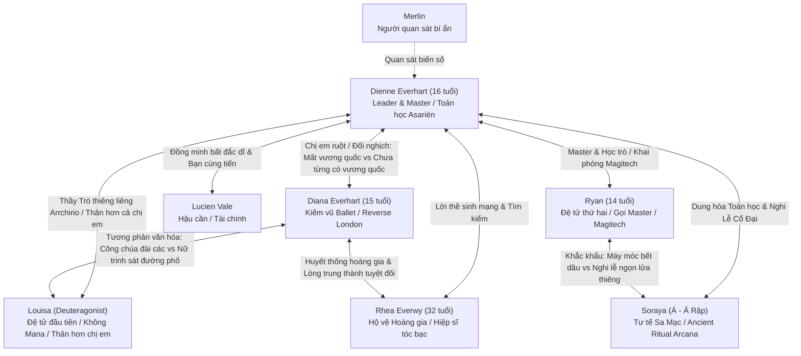

# Story Bible: Hồ Sơ Nhân Vật (Characters)

> **Tệp này ghi nhận tính cách, giọng điệu, mục tiêu, trang bị và cấm kỵ của từng nhân vật trong tác phẩm.**
> Mọi chương viết ra phải tuân thủ nghiêm ngặt hồ sơ này để đảm bảo không bị biến dạng tính cách (**OOC - Out of Character**).

---

# 1. NHÂN VẬT CHÍNH: Dienne Everhart

### Thông Tin Cơ Bản
- **Họ và tên**: Dienne Everhart (Bí danh tại Học viện: *Dienne Hart*).
- **Xuất thân**: Công chúa của Vương quốc Tự trị Everhart (đã bị Đế quốc Aurelia xóa sổ trong đêm thanh trừng).
- **Độ tuổi qua các Volume**:
  - *Volume 1*: 6 tuổi (đêm Everhart sụp đổ) $\to$ 12 tuổi (ngọn lửa lam đầu tiên) $\to$ 15 tuổi (rời thung lũng tuyết).
  - *Volume 2 - 3*: 15 $\to$ 16 tuổi (tại Aetheris và thâm nhập Kyoto).
  - *Volume 4*: 16 tuổi (thành lập Arrchirio mới tại pháo đài ngầm Sector 7).
- **Ngoại hình**: Dáng người thon gọn, dẻo dai. Mái tóc dài màu hạt dẻ buộc gọn gàng sau gáy. Đôi mắt màu lam thẫm sâu thẳm như hồ băng, ánh mắt tĩnh lặng, kiên nghị vượt xa tuổi tác.
- **Trang phục & Hành trang**:
  - Áo choàng đen sờn gấu có mũ trùm.
  - Chiếc trâm cài vương tộc Everhart giấu kín dưới đáy túi da.
  - Huy hiệu nhánh cây bạc của Arrchirio cài sát bên ngực trong.
  - Cuốn sổ tay ghi chép ngữ pháp Asariën và sơ đồ năng lượng hai thế giới.
  - **Vũ khí bất ly thân**: Thanh kiếm gỗ cũ kỹ sứt sẹo của Rhea, giắt chặt bên hông trái.

### Động Cơ & Tâm Lý (The Core Arc)
- **Khao khát bề nổi (Want)**: Tìm thấy Rhea Everwy và lật tẩy kẻ phản bội đã hủy diệt quê hương Everhart.
- **Nhu cầu nội tâm (Need)**: Vượt qua lòng căm thù cá nhân; nhận ra thế giới không đơn giản chỉ là "thiện vs ác"; học cách trở thành người bảo vệ Cân Bằng thực sự thay vì biến Arrchirio thành công cụ báo thù.
- **Vết thương quá khứ (The Ghost/Wound)**: Đêm lâu đài Everhart bốc cháy năm 6 tuổi, phải trốn dưới gầm bàn và nhìn bóng lưng Rhea ở lại bọc hậu giữa biển lửa.
- **Điểm yếu (Flaw)**: Quá dựa vào phân tích lý thuyết toán học/công thức; ban đầu thiếu kinh nghiệm thực chiến đường phố; đôi khi quá gánh vác trách nhiệm một mình.

### Phong Cách Ma Thuật & Chiến Đấu
- **Thế mạnh**: Tư duy toán học kết hợp ngữ pháp Asariën nguyên bản. Tốc độ phân tích cấu trúc ma trận cực nhanh, triển khai phép không có động tác thừa.
- **Vũ khí**: Kết hợp truyền mana gia cố độ cứng/bén vào thanh kiếm gỗ + phóng thích ma thuật nguyên tố (gió nén, lửa lam tinh khiết, ma trận phong tỏa).

### Truyền Thống Thầy - Trò Thiêng Liêng (Arrchirio Master - Disciple Bond)
- Arrchirio truyền đời bằng liên kết **Thầy - Trò (Master - Disciple)** vô cùng thiêng liêng:
  - Người Thầy Già truyền dạy và rèn giũa Dienne.
  - Giờ đây, Dienne trở thành **Master**:
    * **Louisa**: **Học trò đầu tiên**, người đầu tiên đồng hành, nhân vật chính thứ hai. Tình cảm thầy trò gắn kết thiêng liêng, thân thiết và thấu hiểu nhau còn hơn cả chị em ruột thịt.
    * **Ryan**: **Học trò thứ hai**, được Dienne khai phóng tư duy cơ khí và toán học Asariën; Ryan gọi Dienne là **"Master"**.

### Giọng Thoại & Hành Vi
- **Xưng hô**:
  - Với **Louisa**: Thân mật, ấm áp, tin cậy tuyệt đối, vừa là người thầy dẫn dắt vừa là tri kỷ thấu hiểu nhau hơn chị em.
  - Với **Ryan**: Ryan gọi Dienne là **"Master"** (cách gọi tự nhiên, gần gũi, không câu nệ sáo rỗng).
  - Với **Soraya**: Tôn trọng như một học giả cổ đại đồng hành ngang hàng.
  - Với **Lucien**: "Tôi - Cậu" (đồng minh thân thiết, bạn cùng tiến).
  - Với **Rhea**: "Em - Chị" (lời thề sinh mạng).
- **Hành vi vô thức khi căng thẳng**: Ngón tay chạm vào chuôi kiếm gỗ của Rhea; ánh mắt khóa chặt đối phương và tính toán trong đầu.
- **CẤM KỴ OOC**:
  - Tuyệt đối KHÔNG hành xử như kẻ phản diện mù quáng vì thù hận (không biến Arrchirio thành nhóm khủng bố như Vane muốn).
  - Không bao giờ tự phụ mình là thiên tài toàn tri.
  - Không bao giờ phá vỡ lời thề móc ngoéo với Rhea.

---

# 2. NGƯỜI BẢO VỆ: Rhea Everwy

### Thông Tin Cơ Bản
- **Họ và tên**: Rhea Everwy.
- **Vai trò**: Đội trưởng Đội Hộ vệ Hoàng gia Everhart; người bảo vệ và là chỗ dựa tinh thần lớn nhất thời thơ ấu của Dienne.
- **Độ tuổi**: Khoảng 22 tuổi (khi Everhart sụp đổ) $\to$ Khoảng 32–33 tuổi theo dòng thời gian bên ngoài (ở thời điểm hiện tại Post-Vol 5 / Vol 6). Tuy nhiên, vì bị cuốn vào Dòng Chảy Ma Thuật (Astral Current) nơi thời gian tuyến tính bị đóng băng, tuổi sinh học của Rhea vẫn được bảo toàn nguyên vẹn ở thời điểm rơi vào vết nứt (~22–24 tuổi).
- **Ngoại hình**: Dáng người cao ráo, vững chãi. Mái tóc màu bạc cắt ngắn ngang vai. Đôi mắt xám tro lạnh lùng nhưng ấm áp. Giáp nhẹ hoen rỉ mang nhiều vết chém, áo choàng rách mang huy hiệu Everwy phai màu. Bàn tay chằng chịt sẹo kiếm.
- **Trang bị**: Trường kiếm bạc phát ra luồng kiếm khí sắc lẹm, bão mana màu bạc.

### Tính Cách & Động Cơ Cốt Lõi
- **Bản chất của sự biến mất (Twist Vĩ Đại)**:
  - Rhea **không chết, không bị bắt giam, không phản bội, và tuyệt đối KHÔNG bỏ rơi Dienne**.
  - Đêm hoàng cung Everhart sụp đổ năm Dienne 6 tuổi, khi một mình bọc hậu dưới chân Cổng Cổ Đại, sự sụp đổ áp suất không gian đã cuốn Rhea vào **Dòng Chảy Ma Thuật (The Astral Current / Mana Current)**.
  - Rhea bị dòng chảy thời-không nuốt chửng, trôi dạt vô định ngoài dòng thời gian bình thường mà không có bất kỳ cơ hội nào để tự quay trở lại.
  - Suốt 10 năm Dienne lớn lên trong cô độc, Dienne luôn mang vết thương lòng rằng người hiệp sĩ đã hy sinh hoặc bỏ rơi mình. Nhưng sự thật nghiệt ngã là: **Rhea chưa từng có cơ hội quay lại**.

---

### Màn Tái Xuất Ở Trận Đấu Cuối Cùng (The Final Climax Payoff)
- **Rhea KHÔNG xuất hiện sớm** ở các Volume giữa, mà sự trở lại của cô được giữ kín cho đến **Trận Chiến Cuối Cùng (The Final Battle)** để tạo nên cú nổ cảm xúc lớn nhất toàn bộ series:
  - Khi New Arrchirio đã liên kết các thành phố ma thuật, tập hợp đủ đồng minh (Lucien, Ryan, Soraya, Diana, Louisa...), nhưng vẫn đứng trước bờ vực diệt vong trước kẻ thù tối thượng.
  - Căn cứ sụp đổ, hệ thống Cổng vỡ vụn, các đồng minh đều trọng thương, Dienne đứng đơn độc trơ trọi giữa đống đổ nát, cầm thanh kiếm gỗ cũ kỹ chuẩn bị đón nhận đòn kết liễu.
  - Đúng khoảnh khắc tuyệt vọng nhất: Một khe nứt không gian rách toạc. **Dòng Chảy Ma Thuật tràn ra như một thác lũ ánh sáng bạc**.
  - Một bóng người bước qua: Áo giáp cũ sứt mẻ, trường kiếm bạc, mái tóc ngắn màu bạc sương gió: **RHEA EVERWY**.

### Cảnh Nhận Ra Nhau (Recognition Scene)
- Dienne **không nhận ra ngay lập tức**, vì trong tâm trí cô, người phụ nữ ấy đã biến mất hàng chục năm và thuộc về một cõi hư vô xa xăm.
- Rhea đứng trước mặt Dienne, nhìn cô gái mười mấy tuổi mang thanh kiếm gỗ của mình, rồi thốt lên câu nói in sâu vào ký ức tuổi thơ:
  > *"Ta đã bảo em bao nhiêu lần rồi? Đừng để thanh kiếm nằm quá xa tay."*  
  *(hoặc: "Công chúa không được đứng giữa chiến trường như thế.")*
- Giây phút ấy, cả thế giới sụp đổ trong Dienne. Cô gái kiên cường như đá tảng chết lặng giữa khói lửa. Người bảo hộ của cô... đã thực sự trở về.

---

### Cảnh "Hai Lựa Chọn" Sau Trận Cuối (The Two Choices)
Sau khi đánh bại kẻ thù tối thượng, Dòng Chảy Ma Thuật mở ra một lần cuối cùng trước khi khép lại vĩnh viễn, đặt Rhea trước hai ngã rẽ định mệnh:
1. **Lựa chọn 1 — Quay về quá khứ**:
   - Dòng chảy có thể đưa Rhea trở về đúng khoảnh khắc đêm Everhart bốc cháy năm Dienne 6 tuổi.
   - Cô có thể bế cô bé chạy thoát, cứu sống Tiên vương, sửa chữa lại toàn bộ bi kịch quá khứ.
   - **Cái giá**: Dòng thời gian hiện tại sẽ bị xóa sổ! Dienne của ngày hôm nay, Diana, Louisa, New Arrchirio, những tình bạn và sự trưởng thành mà họ đã đánh đổi bằng xương máu sẽ tan thành mây khói!
2. **Lựa chọn 2 — Ở lại tương lai hiện tại**:
   - Chấp nhận rằng quá khứ đã trôi qua. Nhìn nhận rằng Dienne không còn là cô bé cần người che chở nữa.

### Lời Bộc Bạch & Quyết Định Của Rhea
Rhea nhìn vào khe nứt không gian đang vẫy gọi về quá khứ, rồi quay lại nhìn Dienne:
> *"Ta từng nghĩ mình chỉ sống để quay lại... Ta nghĩ nếu có một ngày được trở về, ta sẽ ôm lấy cô bé ấy và nói rằng mọi chuyện rồi sẽ ổn.*  
> *Nhưng ta đã nhìn thấy em.*  
> *Em không còn là cô bé mà ta từng mang khỏi Everhart nữa.*  
> *Em đã có bạn bè. Em đã có một nơi thuộc về mình. Và em đã tự mình đi đến tận đây.*  
> *Ta không muốn quay về để cứu một quá khứ đã không còn tồn tại.*  
> *Lần đầu tiên trong đời... ta muốn chọn tương lai."*

### Signature Ending Line Của Series
Dienne không nói một lời nào, đôi mắt rưng rưng ngấn lệ, từ từ đưa bàn tay đầy vết chai sạn ra phía trước.  
Rhea nhìn bàn tay ấy, khẽ mỉm cười, tiến một bước lên đứng ngang hàng bên cạnh Dienne, nắm chặt lấy tay cô và nói:

> **“I'll stay by your side.”**

*(Giữ nguyên câu tiếng Anh, không dịch)*.  
- **Ý nghĩa tối thượng**: 
  - Trong Tập 1: Rhea nói *"Ta sẽ theo sau em"* nhưng rồi bị cuốn mất.
  - Tại Trận cuối: **“I'll stay by your side.”** — Lần này, cô thực sự ở lại!
  - Rhea không ở lại như một người bề tôi phục vụ công chúa bé nhỏ, mà ở lại với tư cách một người đồng đội bình đẳng đứng cạnh người phụ nữ vĩ đại mà Dienne đã tôi luyện trở thành. Đây chính là câu kết thúc hoàn hảo cho toàn bộ thiên sử thi Arrchirio!

---

# 3. NHÂN VẬT CHÍNH THỨ HAI (DEUTERAGONIST) & HỌC TRÒ ĐẦU TIÊN: Louisa

### Thông Tin Cơ Bản
- **Tên chính thức và duy nhất**: **Louisa** (Louisa chỉ là Louisa — không bí danh, không họ tộc, không số hiệu).
- **Xuất thân & Nghịch cảnh dòng dõi**:
  - Sinh ra trong một **gia tộc phù thủy cổ xưa (witch lineage)** lâu đời, nhưng oái oăm thay cơ thể cô lại **hoàn toàn không có lấy một tí phép thuật nào ($\Psi = 0$)**.
  - Bị dòng họ xem như một kẻ khiếm khuyết, Louisa rời bỏ thế giới ma thuật sang ẩn náu và mưu sinh tại **Kyoto (Nhật Bản, Trái Đất)**.
  - **Bù lại nghịch cảnh**: Cô sở hữu thể chất phi thường, cơ thể dẻo dai nhanh nhẹn tuyệt đỉnh, khả năng dùng kiếm, dao găm tantō và phản xạ cận chiến đạt đến mức xuất quỷ nhập thần, kết hợp sử dụng thành thạo súng đạn hiện đại và công nghệ trần thế.
- **Vị trí cốt lõi trong toàn bộ series**:
  - **Nhân vật chính thứ hai (Deuteragonist)** của tác phẩm, kề vai sát cánh cùng Dienne qua mọi biến cố.
  - **Học trò đầu tiên (First Disciple)** và là **người đầu tiên thực sự đồng hành cùng Dienne**.
  - **Mối quan hệ với Dienne**: Tình cảm Thầy - Trò theo truyền thống thiêng liêng của Arrchirio, **thân thiết và thấu hiểu nhau còn hơn cả chị em ruột thịt**.  
    *(Lưu ý Canon: Danh xưng "Master" là biểu tượng của sợi dây kế thừa tri thức và sự gắn kết tâm hồn sâu sắc, **tuyệt đối không phải là cấp bậc hành chính hay chức vụ quan liêu**).*
- **Độ tuổi**: Khoảng 17 - 18 tuổi.
- **Ngoại hình**: Cô gái châu Á mảnh khảnh, ánh mắt sắc sảo, mái tóc đen buộc túm cẩu thả sau gáy. Trang phục đặc trưng: Áo khoác bomber đen rộng thùng thình, áo phông trắng, quần túi hộp thụng, giày bốt đen. Miệng thường xuyên ngậm kẹo mút vị dâu hoặc nhai kẹo cao su thổi bóng.
- **Trang bị & Đạo cụ Biểu Tượng**:
  - **Thanh Đại Thái Đao (Ōdachi / Nodachi) bọc vỏ gỗ Côn Lôn**: Vũ khí cận chiến biểu tượng bất ly thân của Louisa (thu được tại hang động tuyết Côn Lôn ở Volume 7). 
    * *Đặc tính 3 tầng*:
      1. **Tầng 1 — Vật lý:** Cực bền, giữ cạnh sắc vượt trội qua thời gian, độ dẻo dai và cân bằng trọng lực tuyệt hảo; không thể gãy trong điều kiện bình thường nhưng không phải "thần khí bất khả hủy".
      2. **Tầng 2 — Ma thuật:** "Ổn định vật chất cực cao + tương tác mana cực thấp". Không dẫn mana, không hấp thụ mana, trơ với sự ăn mòn của phép thuật. Không phải "anti-magic auto-hack"; để phá hủy kết giới hay khí tài ma đạo, Louisa phải dùng kinh nghiệm và đôi mắt tinh tường tìm đúng điểm neo vật chất hoặc mối nối chịu lực rồi chém vào đó.
      3. **Tầng 3 — Lịch sử & Văn hóa:** Lưỡi đao rèn bởi danh tượng Nhật Bản thời Thế chiến, theo chân một kiếm khách tự xưng đệ nhất sang Côn Lôn và trải qua trận quyết đấu huyền thoại. Vỏ đao được đẽo gọt mộc mạc từ gỗ núi Côn Lôn bởi người ở lại.
    * *Triết lý cốt lõi*: **Thanh kiếm không chọn Louisa. Louisa chọn thanh kiếm.**
  - Súng lục giảm thanh giắt trong bao da dưới nách (dùng đạn hợp kim nặng trịch phi ma thuật).
  - Dao găm ngắn / tantō dắt ngang thắt lưng sau.
  - Còi bạc cộng hưởng âm tần phá sóng ma trận.
  - Súng phóng dây móc leo trèo.
  - Túi bùa chú yểm sẵn và ma thạch thô (dùng bằng mẹo kích hoạt cơ học chứ không tự dẫn mana).
  - Chiếc smartphone màn hình nứt góc dùng để liên lạc và định vị bản đồ đô thị.

---

### Bản Chất Năng Lực & Bước Ngoặt Giác Ngộ Cùng Dienne
- **100% Con người bình thường về mặt sinh học**.
- **HOÀN TOÀN KHÔNG CÓ MANA NỘI TẠI ($\Psi = 0$)**. Không thể tự sinh mana, không có mạch mana trong cơ thể.
- **TUYỆT ĐỐI KHÔNG BAO GIỜ THỨC TỈNH MANA**.
- **Sự thức tỉnh vĩ đại**:
  - Trước khi gặp Dienne, các phù thủy trong gia tộc luôn nhồi sọ cô rằng ma thuật chỉ có một con đường duy nhất: tụ mana trong người rồi phóng ra.
  - Sau khi gặp Dienne, cô nhận ra rằng **phép thuật có thể triển khai được theo rất nhiều cách**:
    * Hiểu cấu trúc hình học ma trận để né tránh và phản đòn.
    * Nhận biết điểm nút chịu lực để bắn vỡ vòng bảo hộ.
    * Kích hoạt ma cụ và bùa chú bằng mẹo cơ học và động năng.
    * Điều hướng vector dòng chảy bằng tư duy Asariën.
  - Louisa học cách hiểu ma thuật sâu sắc hơn bất kỳ phù thủy nào mà không cần phải có mana!

---

### Vai Trò Trong New Arrchirio
- **Vị trí cốt lõi**: **Trinh sát, Thực chiến đường phố, Am hiểu thế giới thực, Xử lý mục tiêu phi pháp**.
- **Tầm vóc biểu tượng**: **Người đứng ở điểm giao giữa hai nền văn minh**. Là chiếc cầu nối thực tế giúp Arrchirio không bao giờ rơi vào cái bẫy kiêu ngạo của giới phù thủy.

---

### Quá Trình Gắn Kết & Lời Mời Đồng Hành Cùng Dienne
1. **Đối đầu ban đầu** (Chạm trán tại Cổng Rò Rỉ ở Kyoto, đọ súng và kiếm gỗ).
2. **Hợp tác bất đắc dĩ** (Cùng phong tỏa Cổng đang đe dọa nổ tung lưới điện đô thị).
3. **Thấu hiểu lẫn nhau**:
   > Dienne nhìn Louisa: *"Cậu không có mana."*  
   > *"Ừ."*  
   > *"Vậy mà cậu vẫn chiến đấu được như thế... Cậu có muốn học phép thuật không?"*  
   > Louisa bật cười: *"Tôi không có mana. Vậy học kiểu gì?"*  
   > Dienne nhìn những mảnh ma cụ vỡ trên mặt đất: *"Học cách hiểu nó."*  
   > Louisa nhìn cô một lúc lâu: *"...Nghe cũng được."*
4. **Lời mời đồng hành**:
   > Dienne: *"Louisa. Cậu có muốn đi cùng tôi không?"*  
   > *"Đi đâu?"*  
   > *"Khắp thế giới."*  
   > *"Nghe giống một câu rủ đi du lịch. Có nguy hiểm không?"*  
   > *"Có."*  
   > *"Có tiền không?"*  
   > Lucien ở phía sau lập tức chen vào: *"Không nhiều."*  
   > Louisa bật cười: *"Thế thì còn phải suy nghĩ."*

- **Động cơ thực sự của Louisa**:  
  Louisa đã dành phần lớn tuổi trẻ nhìn thế giới phép thuật từ bên ngoài qua những thứ tồi tệ và xấu xí nhất (buôn lậu, tội phạm, vết nứt rò rỉ). Dienne là người đầu tiên trao cho cô cơ hội: **Đi để nhìn thấy một thế giới phép thuật chân chính mà cô chưa từng được biết**.

---

### Khoảnh Khắc Nhận Chiếc Ghế Trống (Không Long Trọng, Không Bề Trên)
Louisa không "được tuyển dụng" và không cần thề thốt gia nhập tổ chức. Sự gia nhập của cô là sự công nhận bình đẳng và gắn kết tự nhiên:
> Dienne đẩy một chiếc ghế về phía cô: *"Ngồi đi."*  
> Louisa nhìn chiếc ghế: *"Cái gì đây?"*  
> *"Chỗ của cậu."*  
> *"Tôi đâu có nói là tôi gia nhập."*  
> Dienne mỉm cười: *"Tôi cũng đâu hỏi."*  
> Louisa nhìn cô vài giây... rồi thản nhiên kéo ghế ngồi xuống, nhai kẹo mút: *"Được thôi."*

---

### Tuyến Truyện Tối Hậu Của Deuteragonist: Hành Trình Khám Phá Khởi Nguồn Ma Thuật (Post-Ending / Epilogue Arc)
- **Định vị cốt truyện**: Tuyệt đối không giải quyết nguồn gốc tối hậu của ma thuật trong trận đánh trùm cuối (để giữ sự tập trung cho trận chiến Cân Bằng của Dienne).
- **Hành trình riêng biệt của Louisa**:
  - Sau khi Đại Chiến Cánh Cửa Thứ Bảy kết thúc và hòa bình được tái lập giữa hai thế giới, Dienne lui về giữ trọng trách duy trì Trật Tự Ranh Giới.
  - Lúc này, **Louisa**—cô gái người thường duy nhất $\Psi = 0$ đã đi qua mọi nẻo đường cùng các bậc thầy ma pháp—bắt đầu cuộc phiêu lưu vĩ đại của riêng mình: **Tiến sâu vào Rừng Cội Nguồn (Origin Grove) của loài Lunar Elves**.
  - Loài Elves tôn trọng Louisa vì cô thấu hiểu bản chất phép thuật mà không hề có lòng tham ma lực. Họ cho phép cô bước vào Thánh Địa Nguyệt Thần để tìm hiểu **Sự Khởi Đầu Của Phép Thuật (The Genesis of Magic)**:
    * *Tại sao cô sinh ra trong một gia tộc phù thủy nhưng lại hoàn toàn không có mana?*
    * *Liệu tổ tiên loài người ở thế giới thực đã từng sở hữu mana trước khi một biến cố địa chất/vũ trụ tước đoạt nó?*
    * *Bản chất của mana là một quy luật vật lý tự nhiên chưa được đặt tên, hay là một "ký sinh trùng không-thời gian" rò rỉ từ chiều không gian cao hơn?*
  - Đây là cái kết mở tráng lệ và đầy triết lý, tôn vinh vị thế Deuteragonist của Louisa.

---

# 4. HẬU CẦN & CHẾ TÁC: Lucien Vale

### Thông Tin Cơ Bản
- **Họ và tên**: Lucien Vale.
- **Vai trò trong Arrchirio mới**: Phụ trách mạng lưới thông tin, tài chính, hậu cần và mua sắm ma cụ. Bạn đồng hành bình đẳng của Dienne.
- **Độ tuổi**: 16 - 17 tuổi.
- **Xuất thân**: Học viên chuyên ngành Chế tác Ma cụ tại Học viện Aetheris.
- **Ngoại hình**: Mái tóc nâu rối bù, ngón tay luôn dính muội than ma thạch, áo khoác nhiều túi nhét đầy bản đồ và phát minh dở dang. Chiếc la bàn ma lực định hướng dòng chảy năng lượng luôn đeo trên cổ.

### Tính Cách & Giọng Thoại
- Thực dụng, láu cá, hay cằn nhằn về tiền bạc và ngân sách ("Tôi là thằng thích tiền, không phải thằng thích chết").
- Tuy luôn miệng kêu ca nhưng khi bạn bè gặp hiểm nguy thì không bao giờ bỏ chạy một mình ("Tôi đâu có nói tôi là thằng thông minh!").
- Điểm tựa đời thường giúp Dienne không bị cô lập trong mớ suy nghĩ triết học nặng nề.

---

# 5. KỸ SƯ MAGITECH & HỌC TRÒ THỨ HAI: Ryan

### Thông Tin Cơ Bản
- **Họ và tên**: Ryan.
- **Vai trò trong Arrchirio mới**: Trưởng ban Kỹ thuật, nghiên cứu Magitech và chế tạo trang thiết bị.
- **Thân phận đặc biệt**: **Học trò thứ hai của Dienne**, gọi Dienne là **"Master"** (cách gọi tự nhiên, tôn kính và gần gũi, không câu nệ lễ nghi nặng nề).
- **Độ tuổi**: 14 tuổi.
- **Xuất thân**: Thợ cơ khí ma đạo tự do tại khu xưởng ngầm Oakhaven.
- **Ngoại hình**: Thiếu niên gầy gò, mái tóc hạt dẻ xù luôn bết dính dầu máy, chiếc kính bảo hộ ma thuật gác lệch trên trán, tay cầm cờ-lê hoặc máy đo ma áp.

### Tính Cách & Tư Duy
- Bộc trực, đam mê máy móc và công nghệ nhị phân từ thế giới thực.
- Được Dienne (Master) hướng dẫn cách kết hợp mạch logic nhị phân với ngữ pháp Asariën, từ đó chế tạo thành công thiết bị xung điện từ (EMP ma đạo) đánh bại Thẩm Phán Viện.
- **CẤM KỴ OOC**: Không được viết Ryan thành "thiên tài toàn năng búng tay là ra máy"; cậu phải luôn thử nghiệm, đo đạc, sai sót và sửa chữa.

---

# 6. HỌC GIẢ NGHI LỄ CỔ ĐẠI & TƯ TẾ LỬA SA MẠC: Soraya

### Thông Tin Cơ Bản
- **Họ và tên**: **Soraya** (Tước hiệu: *Học giả Nghi Lễ Cổ Đại & Tư Tế Ngọn Lửa Sa Mạc*).
- **Vai trò trong Arrchirio mới**: Phụ trách phong ấn cổ, nghiên cứu nghi lễ sa mạc, Ancient Ritual Magic và Celestial Arcana.
- **Độ tuổi**: 17 - 18 tuổi.
- **Xuất thân & Dòng dõi**: Thiếu nữ **châu Á gốc Ả Rập** (Asian - Arab heritage), xuất thân từ dòng dõi tư tế tế lễ sa mạc cổ xưa canh giữ các Cổng bí ẩn vùng Trung Đông / Ả Rập.
- **Ngoại hình** *(Chuẩn xác theo tạo hình quý phái)*:
  - Nét đẹp lai Á - Ả Rập kiêu sa đài các, đôi mắt huyền sâu thẳm mang chiều sâu ngàn năm, làn da mịn màng quý tộc.
  - Mái tóc đen dài bồng bềnh uốn lượn cài dải trang sức kim hoàn vàng tinh xảo vắt ngang trán (Arabian golden circlet) đính ngọc lục bảo lấp lánh.
  - Trang phục dạ hội lụa đen huyền bí viền kim hoàn vàng sang trọng, áo cúp ngực tôn vòng eo thon thả, váy xếp ly xẻ tà quý phái, đôi găng tay lụa đen dài qua khuỷu tay.
  - **Pháp bảo bất ly thân**: **Vương trượng Cổ Ngọn Lửa (Ancient Flame Scepter)** làm bằng gỗ mun khảm vàng, đầu trượng là quả cầu ngọc bốc cháy ngọn lửa thiêng vàng cam rực rỡ, liên tục tỏa ra những đốm lân tinh tàn tro ma thuật lơ lửng.

### Phong Cách Ma Thuật & Tư Duy
- **Trường phái**: **Ancient Ritual Magic (Ma thuật Nghi Lễ Cổ Đại)** và **Nghệ thuật Tinh Tú Sa Mạc (Celestial & Sun Arcana)**.
- Không dùng ngữ pháp Asariën châu Âu thông thường của Đế quốc, mà vận hành bằng Cổ ngữ Chiêm Tinh (Celestial Glyphs), nghi lễ thanh tẩy và ngọn lửa nguyên thủy.
- Tôn kính các quy luật cổ xưa của đất trời; thường xuyên tranh luận hài hước với Ryan (*"Cậu lại làm bẩn tấm thảm nghi lễ bằng dầu máy rồi đấy!"*).
- Nhìn nhận Dienne là một Master thực thụ của Arrchirio có đủ tư cách phục hưng Cân Bằng hai cõi.

---

# 7. NGƯỜI QUAN SÁT CỔ ĐẠI: Merlin

### Thông Tin Cơ Bản
- **Tên**: Merlin (Tên thật, tuổi thật, chủng tộc: **CHƯA ĐƯỢC TIẾT LỘ**).
- **Vị trí**: Người quan sát bí ẩn đứng ở ranh giới giữa các thế giới, đang theo dõi sự dao động của Cổng thứ bảy.
- **Đặc trưng**:
  - Am hiểu sâu sắc về mana, Asariën, Cổng và lịch sử cổ đại.
  - **TUYỆT ĐỐI KHÔNG TOÀN TRI**: Kiến thức của Merlin có giới hạn. Cô có thể đưa ra giả thuyết sai hoặc bị bất ngờ trước những thứ vượt ngoài mô hình của mình (như Cánh Cửa Thứ Hai).
  - Không can thiệp trực tiếp để giải quyết vấn đề hộ nhân vật chính.
- **Câu nói triết lý nền tảng**:
  > *"Không có phép nào mạnh, phép nào yếu — chỉ có nhiều mana và ít mana."*
  > *"Phép thuật chính là thứ phóng đại bản chất con người."*

---

# 8. CÔNG CHÚA CHƯA TỪNG CÓ VƯƠNG QUỐC: Diana Everhart
### (Diana of Reverse London)

### Thông Tin Cơ Bản
- **Họ và tên**: Diana Everhart (Tên thường gọi tại Reverse London: *Diana Sterling*).
- **Xuất thân**: Công chúa thứ hai của Vương tộc Everhart, em gái ruột của Dienne Everhart. Sinh ra tại **Reverse London** (London Nghịch Đảo) sau khi cha mẹ trốn thoát khỏi đêm thanh trừng của Đế quốc Aurelia.
- **Độ tuổi**: Khoảng 14 – 15 tuổi (kém Dienne khoảng 1 – 2 tuổi).
- **Ngoại hình**: Vẻ đẹp thanh tao, đài các toát lên từ trong máu tủy. Mái tóc vàng óng gợn sóng buông nhẹ sau lưng, đôi mắt màu lam trong veo như pha lê (màu mắt đặc trưng của dòng máu hoàng gia Everhart).
- **Trang phục**: Thường mặc váy dạ hội cách tân hoặc âu phục quý tộc Anh may bằng lụa sẫm màu, tà váy xếp ly mềm mại được thiết kế đặc biệt để mở rộng tối đa theo từng bước xoay người khi múa kiếm.
- **Vũ khí**: Một thanh liễu kiếm (rapier) bằng bạc tinh luyện mỏng nhẹ và dẻo dai, chuôi kiếm nạm đá sapphire khắc gia huy rồng vàng Everhart.

---

### Nghịch Lý Cốt Lõi: Hai Nàng Công Chúa Của Everhart
Tác phẩm xây dựng một cặp đối trọng mang tính triết học và cảm xúc sâu sắc giữa hai chị em:

> **"Dienne là công chúa đã mất vương quốc."**  
> *(The Princess Who Lost Her Kingdom)*  
> **"Diana là công chúa chưa từng có vương quốc."**  
> *(The Princess Who Never Had A Kingdom)*

- **Dienne**: Bị tước đoạt vương quốc lúc 6 tuổi, lớn lên trong thung lũng tuyết giá lạnh, ăn bánh mì khô, mặc áo choàng sờn gấu, dùng kiếm gỗ sứt sẹo, tư duy bằng toán học và sự tàn khốc của sinh tồn. Dienne lớn lên gần như quên mất thế nào là cuộc sống hoàng gia. Với Dienne, *Everhart là một vết thương rỉ máu*.
- **Diana**: Sinh ra trong một ngôi nhà bình dân ở Reverse London, nơi cha mẹ cô phải giấu thân phận, dùng tên giả và làm lụng như thường dân để mưu sinh. Nhưng trong căn nhà bình thường ấy, cha mẹ đã dồn hết tâm huyết âm thầm truyền dạy cho cô mọi chuẩn mực của hoàng tộc: lễ nghi, văn hóa, lịch sử, khiêu vũ, âm nhạc, kiếm thuật và ma thuật. Với Diana, *Everhart là một nền văn hóa, một bản trường ca đẹp đẽ chưa từng được nhìn thấy bằng mắt thường*.

### Khoảnh Khắc Hội Ngộ Giữa Hai Chị Em
- Khi Dienne nhìn Diana: *"Em ấy trông giống một công chúa thực thụ hơn mình..."*
- Khi Diana nhìn Dienne: *"Chị mới là người thực sự sống cuộc đời mà em chỉ được nghe kể qua lời ru của cha mẹ..."*

---

### Khí Chất & Phong Thái Tự Nhiên
- Diana không bao giờ phải cố tỏ ra sang chảnh. Khí chất vương giả đã ăn sâu vào phản xạ vô thức:
  - Người khác bước vào phòng: Kéo ghế ngồi bệt xuống.
  - Diana bước vào phòng: Vô thức chỉnh lại nếp váy, giữ lưng thẳng tắp thanh nhã, mỉm cười và cúi chào mọi người chuẩn xác theo lễ nghi hoàng gia cổ xưa.
- **Tài năng đặc biệt — Giọng hát cộng hưởng (Vocal Harmonic Magic) & Giới hạn Hard Magic nghiêm ngặt**:
  - *Cơ chế vật lý*: Giọng hát của Diana sở hữu âm vực và độ trong trẻo hiếm có, có khả năng tạo ra sóng âm điều hòa cộng hưởng với tần số dao động của các hạt mana tự nhiên.
  - *Điều kiện biên chặt chẽ (TUYỆT ĐỐI KHÔNG PHẢI KHẮC CHẾ MỌI CÔNG NGHỆ)*:
    1. **Chỉ tác động lên hệ thống có cấu trúc thuật toán Everhart / Asariën**: Sở dĩ giọng hát của Diana can thiệp được vào cỗ máy nén tại Big Ben là vì cỗ máy này do chính Hoàng thúc Alden Everhart thiết kế dựa trên các phương trình dao động hoàng gia Everhart cổ; Diana nắm bắt được "giai điệu khóa" (counter-frequency) tương ứng.
    2. **Đòi hỏi môi trường mana và thời gian lấy mẫu**: Cần có môi trường mana tự nhiên để dẫn truyền sóng âm; không thể phát huy tác dụng trong chân không, vùng triệt tiêu hoàn toàn ($\Psi = 0$) hoặc khi đối phương sử dụng rào chắn cách âm cơ học.
    3. **Hoàn toàn vô hiệu trước công nghệ phi mana & ma thuật ngoại lai**: Giọng hát không có tác dụng gì trước súng đạn động năng của Louisa, động cơ hơi nước cơ khí thuần túy, hay ma thuật cát sa mạc của Soraya.

---

### Phong Cách Chiến Đấu: Kiếm Vũ Ballet & Ma Thuật Trong Chuyển Động

#### 1. Kiếm Thuật Ballet (Ballet-Swordsmanship):
Kiếm pháp của Diana hoàn toàn không dựa vào cơ bắp hay những cú chém nặng nề. Nó là sự tinh hoa của: **Bước chân (Footwork) $\to$ Thăng bằng (Balance) $\to$ Xoay mũi chân (Pirouette) $\to$ Trọng tâm $\to$ Nhịp điệu $\to$ Độ chính xác tuyệt đối**.
- Nhìn từ bên ngoài, đối thủ ngỡ như cô đang biểu diễn một khúc múa ba-lê cổ điển trên sân khấu. Nhưng thực chất, mỗi bước trượt, mỗi cú xoay người đều là một quỹ đạo chết người:
  > *Diana xoay tròn trên mũi chân. Mũi liễu kiếm lướt qua khoảng không như một nét cọ bạc mảnh mai. Một bước. Hai bước. Tà váy xếp ly bung xòe theo chuyển động cơ thể. Đối thủ vừa kịp nhận ra mình đã bị áp sát thì lưỡi kiếm lạnh toát đã dừng chuẩn xác ngay trước yết hầu.*

#### 2. Ma Thuật Dệt Trong Vũ Điệu (Magic in Motion):
Khác với Dienne: `[Phân tích] -> [Tính toán] -> [Dựng ma trận] -> [Thi triển]`.  
Diana vận hành theo: `[Cảm nhận] -> [Nhịp điệu] -> [Vũ đạo] -> [Thi triển]`.
- Diana không bao giờ đứng yên một chỗ để niệm chú hay vẽ ma pháp trận.
- **Cô múa kiếm để vẽ nên ma pháp trận ngay trong chuyển động**:
  - Mỗi bước nhón chân thay đổi một dòng chảy mana tự nhiên.
  - Mỗi vòng xoay tròn dệt nên một cấu trúc hình học phát quang.
  - Mỗi cú vung mũi kiếm thay đổi hướng vector của thông lượng $\Psi$.
  - Kiếm thuật và ma thuật hòa quyện thành một bản vũ khúc liên tục không có điểm đứt gãy.

---

### Vai Trò Trong Hội Đồng Arrchirio
- Đại diện chính thức cho **Chiếc Ghế Sồi Trống Thứ Ba** tại Bàn Tròn Hội Đồng (Đại diện cho Huyết thống Everhart Hải ngoại & Huyền thuật Reverse London).

---

# 9. ĐẠO SĨ CÔN LÔN: Lục Thanh Vân (Lu Qingyun)
### (Chủ Nhân Chiếc Ghế Sồi Thứ Tư — Bối Cảnh Volume 7)

### Thông Tin Cơ Bản
- **Họ và tên**: Lục Thanh Vân (Đạo hiệu: *Thanh Hư Đạo Sĩ*).
- **Xuất thân**: Truyền nhân chân truyền đời thứ 72 của phái Côn Lôn Thiên Môn (Dãy núi Côn Lôn, Trung Hoa). Người trấn giữ cuối cùng của Trụ Cột Long Mạch phương Đông.
- **Độ tuổi**: Khoảng 17 – 18 tuổi.
- **Ngoại hình**: Dáng người mảnh khảnh nhưng vững vàng như tùng bách trên đỉnh vách đá. Mặc đạo bào màu xanh ngọc bích viền mây trắng thêu hoa văn Bát Quái, tóc đen dài búi cao bằng một chiếc trâm gỗ đào mộc mạc. Khuôn mặt thanh tú, đôi mắt sáng như ngọc bích phát quang, toát lên vẻ điềm tĩnh, thoát tục hiếm có.
- **Vũ khí & Pháp bảo**: 
  - **Kiếm Gỗ Đào Ngàn Năm**: Rèn từ lõi cây đào sét đánh trên đỉnh Tuyết Phong, chuyên khắc chế tà niệm và dẫn truyền luồng "Khí" tự nhiên.
  - **Bát Quái Kính & Chu Sa Phù**: Bộ phù chú vẽ bằng máu rồng chu sa dùng để định vị long mạch và lập kết giới Ngũ Hành.

### Trường Phái: Đạo Pháp Tự Nhiên & Long Mạch Khí Công
- Không sử dụng phương trình toán học Asariën hay máy móc Magitech.
- Vận hành theo triết lý: *"Nhân pháp Địa, Địa pháp Thiên, Thiên pháp Đạo, Đạo pháp Tự nhiên"*.
- Sử dụng dòng chảy của **"Khí"** bên trong kinh mạch để hòa nhập với linh khí của trời đất, điều khiển gió mây và dẫn truyền Long Mạch.

### Vai Trò Trong Hội Đồng Arrchirio
- Đại diện chính thức cho **Chiếc Ghế Sồi Trống Thứ Tư** tại Bàn Tròn Hội Đồng (Đại diện cho Cổ Đạo Phương Đông & Long Mạch Côn Lôn).

### Người Thầy Già (Thung lũng tuyết)
- Tàn dư Arrchirio cũ sống ẩn dật sau cuộc Đại thanh trừng. Áo chùng xám bạc cũ sờn, tẩu thuốc lá.
- Người dạy Dienne bài học vỡ lòng: Phép thuật không phải công cụ để phục tùng sự giận dữ, mà là cuộc đối thoại với thế giới.

### Vane (Bóng ma báo thù)
- Cựu chấp pháp viên Arrchirio cũ lẩn trốn 20 năm dưới pháo đài Sector 7.
- Tâm lý hoang dại, méo mó vì thù hận; muốn biến Arrchirio thành tổ chức khủng bố đánh sập các Cổng và ám sát Đế quốc. Bị Dienne tước vũ khí và từ chối con đường báo thù.

### Kael (Lính đánh thuê Học viện Aetheris)
- Học viên năm ba ít mana nhưng giàu kinh nghiệm thực chiến.
- Người dạy Dienne bài học sấp mặt trong 3 giây bằng nắm cát cay và cán kiếm gỗ: *"Cô tính toán nhanh thật đấy... Nhưng cô quá chậm."*

### Kẻ Phản Bội: Lord Arknight (Hoàng Thúc Alden Everhart)
- **Danh tính thật**: Alden Everhart — em trai ruột của Vua cha Dienne, hoàng thúc ruột của Dienne và Diana Everhart.
- **Lịch sử**: Từng là một trong những học giả ma pháp ranh giới và kiến trúc sư cấu trúc của tổ chức Arrchirio 20 năm trước.
- **Tư tưởng biến chất & Bí ẩn dài hạn**:
  - Tại Volume 6: Nhóm Dienne mới chỉ giải mã được **thân phận thực sự** của Arknight (Alden Everhart) và các chỉ thị hành động thực tế của hắn tại London qua hồ sơ của Malgrave.
  - Động cơ sâu xa và triết lý tối thượng của Alden ("Vì sao một học giả uyên bác lại tin rằng hai thế giới là lỗi toán học và quyết tâm xóa sổ ranh giới?") vẫn là một màn sương bí ẩn lớn sẽ được bóc tách sâu hơn qua các cuộc đối đầu tư tưởng tại Côn Lôn (Volume 7) và Đại Kết Cục.
- **Hành động phản bội**: Bán đứng hoàng thành Everhart và hệ thống phòng thủ Arrchirio cho Đế quốc và Thẩm Phán Viện trong Đêm Đại Thanh Trừng 20 năm trước; giấu kín thân phận dưới danh hiệu *Lord Arknight*, điều khiển mạng lưới tài phiệt ngầm tại Reverse London và các cứ điểm toàn cầu.
- **Ý nghĩa kịch tính**: Tạo nên bi kịch huyết thống sâu sắc nhất cho hai chị em Dienne & Diana — kẻ thù lớn nhất không phải là quái vật vô hình, mà là người mang cùng dòng máu hoàng gia đã lựa chọn con đường độc tài.

---

# 10. MA TRẬN QUAN HỆ & ĐỐI TRỌNG CỐT LÕI

| Nhân Vật A | Nhân Vật B | Tính Chất Quan Hệ | Mâu Thuẫn / Điểm Chạm |
| :--- | :--- | :--- | :--- |
| **Dienne** | **Louisa** | Thầy - Trò thiêng liêng Arrchirio & Tri kỷ vượt trên chị em | Louisa là đệ tử đầu tiên và Deuteragonist. Dienne giải phóng Louisa khỏi định kiến gia tộc phù thủy; Louisa là chiếc mỏ neo kéo Dienne về với thực tế. |
| **Dienne** | **Ryan** | Master & Học trò thứ hai | Ryan gọi Dienne là "Master" tự nhiên, tôn kính; Dienne dạy Ryan kết hợp logic nhị phân với Asariën để tạo ra Magitech. |
| **Dienne** | **Diana** | Chị em ruột thịt, hai mặt của một vương triều | Dienne mất vương quốc trước khi hiểu nó (vết thương); Diana chưa từng có vương quốc nhưng thấu hiểu trọn vẹn văn hóa và cốt cách hoàng gia. |
| **Dienne** | **Rhea** | Lời thề sinh mạng, tình thân ruột thịt | Rhea mang tội lỗi kẻ thất hứa; Dienne quyết tâm chứng minh mình đã đủ sức đứng bên cạnh cô. |
| **Diana** | **Rhea** | Công chúa thứ hai & Người bảo hộ tối cao | Rhea tìm thấy ở Diana hình ảnh huy hoàng mà vương triều Everhart từng có; Diana được nghe về Rhea qua lời ru của mẹ. |
| **Diana** | **Louisa** | Hai thái cực của thế giới thực | Diana múa ballet giữ trọn lễ nghi quý tộc; Louisa ngậm kẹo mút xả đạn giảm thanh — cặp đôi "trái dấu" cực kỳ thú vị khi tác chiến. |
| **Ryan** | **Soraya** | Kỹ thuật máy móc vs Nghi lễ sa mạc cổ đại | Ryan chê nghi thức rườm rà; Soraya quở mắng Ryan vì để dầu máy bôi bẩn thảm tế lễ và vương trượng cổ. |
| **Dienne** | **Vane** | Bảo vệ Cân Bằng vs Báo thù cực đoan | Vane chế giễu sự non nớt của Dienne; Dienne từ chối biến mình thành kẻ ác như Đế quốc. |

